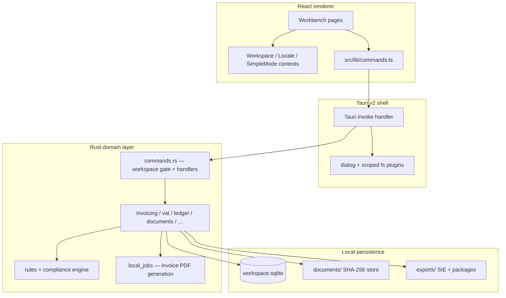

# Architecture Codemap

High-level system overview for the ÖppenBokföring desktop application.

Last updated: 2026-07-11.

## System diagram

## Architectural invariants

| Invariant | Enforcement |
|-----------|-------------|
| Renderer never writes SQLite | ADR-0003; all mutations via `invoke()` |
| Accounting rules in Rust | `tax_rules` + `rule_versions`; not duplicated in UI |
| Idempotency on mutations | `idempotency_key` + `local_jobs` unique constraint |
| Workspace scoping | Every command requires open workspace (`AppState`) |
| Local-first evidence | Content-addressed `documents/` per workspace |
| Prepare-only tax | ADR-0004; no filing or payment initiation |

## Request flow

1. A user action in a React page (`src/pages/*`) calls a typed wrapper in `src/lib/commands.ts`.
2. The wrapper calls Tauri `invoke<T>()`.
3. Tauri routes to a registered `#[tauri::command]` in `src-tauri/src/commands.rs`.
4. The command checks the open `WorkspaceContext` and calls a domain module (`invoicing`, `vat`, and so on).
5. The domain module runs SQLx queries, evaluates the active rules where applicable, and may enqueue `local_jobs`.
6. Success returns `{ data: T }`; failure throws `AppError` (structured, redacted storage errors).

## Major subsystems

| Subsystem | Rust module | Primary UI |
|-----------|-------------|------------|
| Workspace lifecycle | `workspace`, `backup`, `recent` | `WorkspacePickerPage`, `SettingsPage` |
| Profiles & compliance | `profiles`, `compliance`, `rules` | `OnboardingPage`, `DashboardPage` |
| Invoicing & ledger | `invoicing`, `ledger`, `counterparties` | `InvoicesPage`, `LedgerPage` |
| Documents & imports | `documents`, `imports`, `reconciliation`, `expenses` | `DocumentsPage` |
| VAT & cash | `vat`, `cashflow` | `VatPage`, `DashboardPage` |
| Year-end | `year_end` | `YearEndPage` |
| Export | `sie`, `accountant_package` | `SettingsPage` |
| Guided UX (M8) | `settings` | `DashboardPage`, `GuidedTour`, `SimpleModeContext` |
| Background jobs | `jobs` | Invoice PDF status / reveal |

## Error and security model

- **Client errors:** `AppError` with `code`, `message`, optional `details[]`.
- **SQL errors:** Redacted public message; `unique_violation` flag preserved internally for idempotency replay.
- **Path operations:** `paths.rs` + `documents::safe_join_under` + `workspace_open` validates `documents_path` layout.
- **Permissions:** Tauri capabilities — dialog + app-scoped fs only; CSP `default-src 'self'`.

## Testing layers

| Layer | Location | Runner |
|-------|----------|--------|
| Golden scenarios | `fixtures/golden-scenarios/*.json` | `npm run test:golden` |
| UI scenario | `fixtures/ui-scenarios/guided-ux-onboarding-checklist.json` | `npm run test:m8` |
| Rust integration | `src-tauri/tests/*.rs` | `npm run test:rust` |
| Frontend unit/component | `src/**/*.test.ts(x)` | `npm test` |
| Public CI gate | fixtures, Rust, frontend, build, bindings | `npm run ci:public` |

## Related docs

- [README.md](./README.md) — codemap index and current scope
- [MODULES.md](./MODULES.md) — module APIs and dependencies
- [FILES.md](./FILES.md) — directory map
- [`docs/adr/`](../adr/) — binding architecture decisions
- [`docs/schema.md`](../schema.md) — SQLite tables and migrations
- [`CONTRIBUTING.md`](../../CONTRIBUTING.md) — public contributor workflow
